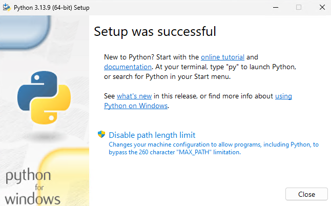
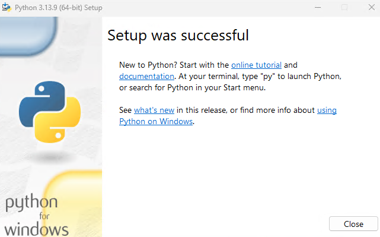

# Oanda Trade Visualizer 📈

A Streamlit dashboard to connect to your Oanda account and visualize your trading history and performance.

---

## 🚀 Installation & Setup

This guide will walk you through setting up the dashboard from scratch.

### For Windows Users

1.  **Install Python:**
    * Download Python 3.13.9 from [this link](https://www.python.org/ftp/python/3.13.9/python-3.13.9-amd64.exe).

2.  **Run the Installer:**
    * Open the downloaded `.exe` file.
    * **IMPORTANT:** At the bottom of the first screen, check **BOTH** boxes:
        * `Use admin privileges when installing py.exe`
        * `Add python.exe to PATH`
    * Then click `Install Now`.
    * 
  
3.  **Disable Path Length Limit:**
    * Once it's done, click the "Disable Path Length Limit".
    * 

4.  **Finish Installation:**
    * When setup is successful, you can click `Close`.
    * 

5.  **Download the Code:**
    * Go to the [GitHub repository](https://github.com/Exclad/oanda-trade-visualizer).
    * Click the green `<> Code` button and select `Download ZIP`.

6.  **Extract Files:**
    * Find the downloaded `.zip` file and extract it to a folder where you want to keep the dashboard (e.g., your Desktop or Documents).

7.  **Run the Dashboard:**
    * Open the extracted folder (e.g., `oanda-trade-visualizer-main`).
    * Double-click the **`run_dashboard_windows.bat`** file.
    * Windows may show a security warning. If it does, click "More info" and then "Run anyway".

---

### For macOS Users

1.  **Install Python:**
    * Download Python 3.13.9 for macOS from [this link](https://www.python.org/downloads/release/python-3139/) (choose the "macOS 64-bit universal installer").
    * Run the installer and follow the on-screen steps.

2.  **Download the Code:**
    * Go to the [GitHub repository](https://github.com/Exclad/oanda-trade-visualizer).
    * Click the green `<> Code` button and select `Download ZIP`.

3.  **Extract Files:**
    * Find and unzip the downloaded file (e.g., in your Downloads or Documents folder).

4.  **Run the Dashboard:**
    * Open the **Terminal** app (you can find it in Applications > Utilities, or with Spotlight search).
    * **First, `cd` into the folder.** Type `cd ` (with a space), then drag and drop the `oanda-trade-visualizer-main` folder from Finder onto the Terminal window and press **Enter**.
    * **One-Time Setup:** Run the following command to make the script executable. You only need to do this *once*.
        ```sh
        chmod +x run_dashboard_mac.sh
        ```
    * **Start the App:** To run the dashboard, type this command and press **Enter**:
        ```sh
        ./run_dashboard_mac.sh
        ```

---

## How to Use

### First-Time Setup

1.  **Installation:** The first time you run the script, a terminal window will open and automatically install all the necessary libraries. This may take a minute.
2.  **Streamlit Welcome:** You'll see a message "Welcome to Streamlit!" asking for an email.
    * 
    * You can leave this blank and just press **Enter**.
3.  **Firewall Popup:** Your computer might show a firewall warning for "Python". This is just Streamlit creating a local web server. You can safely click **Cancel** or "Allow".
    * 
4.  **Enter Credentials:** The dashboard will open in your web browser. Fill in your Oanda Account ID and API Access Token.
    * Follow the link on the page to get your token.
    * **Note:** The API token for your Demo account is different from your Live account.
5.  **Run Dashboard:** Click the "Go to..." button, and your dashboard will be up and running!

### Daily Use

* **Windows:** Just double-click the **`run_dashboard_windows.bat`** file.
* **macOS:** Open Terminal, `cd` to the folder, and run `./run_dashboard_mac.sh`.
* **Change Theme:** To switch between light and dark mode, click the (⋮) menu in the top-right corner of the app, go to **Settings**, and change the **App theme**.

### Stopping the Dashboard

To stop the app, go back to the black terminal/command prompt window and press **`Ctrl`** + **`C`** on your keyboard. You can also just close that window.

---

## 🔒 Security & Privacy

Your API keys and account details are saved locally in `config.ini` and `config_demo.ini` files within the project folder. This information is **not** sent to any server and stays on your computer.
